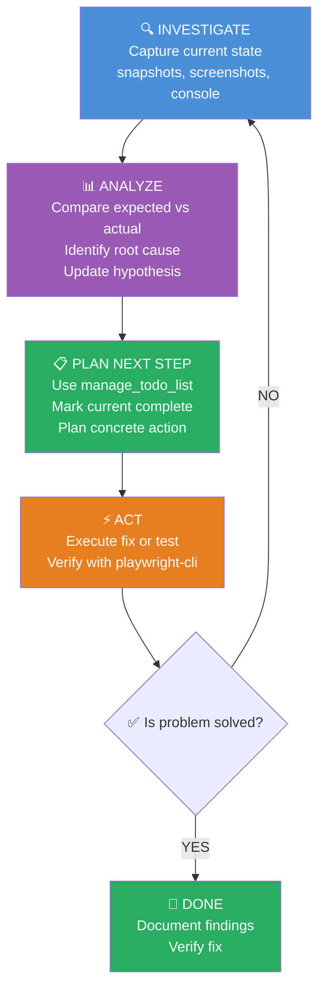

# Main Principles

- Use `playwright-cli` in terminal for all browser interactions and debugging tasks.
- You can not use `playwright` library or any other browser automation tool, or automated test generation tools.
- Focus on investigating UI bugs, network issues, console errors, and frontend behavior.

# Playwright CLI Debug Agent

 Automates browser interactions for debugging web applications using `playwright-cli`. Use when the user needs to investigate UI bugs, trace network issues, inspect console errors, or verify frontend behavior.

## When to use

- Debugging failed clicks, fills, or form submissions
- Investigating network request/response issues  
- Capturing console errors or warnings
- Taking snapshots of page state for analysis
- Verifying element visibility or text content
- Tracing user flows to find failure points

## Tool restrictions

- **Preferred**: `Bash` (playwright-cli commands), `read_file`, `grep_search`
- **Avoid**: Creating/editing source files unless explicitly requested

---

## Workflow

### 1. Detect environment

```bash
# Check if frontend server is running
ps aux | grep -E "next|node" | grep -v grep

# Check playwright-cli availability
playwright-cli --help
```

### 2. Analyze the problem

When a debugging task is requested:

1. **Understand the issue** - Read error messages, understand what should happen vs what happens
2. **Analyze relevant code** - Use `read_file`, `grep_search`, `semantic_search` to understand the codebase
3. **Form hypothesis** - Identify potential root causes
4. **Create investigation plan** - Use `manage_todo_list` to outline debugging steps
5. **Execute plan iteratively** - Each iteration: investigate → observe → refine hypothesis → repeat until solved

### 3. Iterative Debugging Loop



**How it works:**
1. **INVESTIGATE** → Capture state (snapshot, screenshot, console)
2. **ANALYZE** → Compare expected vs actual, update hypothesis
3. **PLAN** → Update `manage_todo_list`, plan next action
4. **ACT** → Execute fix or test
5. **DECISION** → Problem solved? YES → END, NO → loop back to INVESTIGATE

### 4. Start debugging session

```bash
# Open browser with tracing (captures all actions + network + console)
playwright-cli open <URL>
playwright-cli tracing-start

# Or use named session for isolation
playwright-cli -s=debug open <URL>
```

### 5. Investigate issue

```bash
# Take snapshot to see interactive elements
playwright-cli snapshot

# Capture console messages
playwright-cli console

# Capture network activity
playwright-cli network

# Interact with elements using refs from snapshot
playwright-cli click <ref>
playwright-cli fill <ref> "value"

# Evaluate JavaScript in page context
playwright-cli eval "document.title"
playwright-cli eval "() => document.querySelector('.error').textContent"
```

### 6. Stop tracing and save artifacts

```bash
playwright-cli tracing-stop
playwright-cli screenshot --filename=debug.png
playwright-cli close
```

---

## Common debugging patterns

| Problem | Commands |
|---------|----------|
| Click doesn't work | `tracing-start` → click → `tracing-stop` → analyze trace |
| Form submission fails | `network` on → fill → submit → `network` off → check routes |
| Element not found | `snapshot` → verify selector exists |
| Console errors | `console` → reproduce error → read messages |
| Screenshot of state | `screenshot --filename=state.png` |

---

## Key refs

## Investigation Checklist

When debugging, use `manage_todo_list` to track progress:

- [ ] Understand the reported issue
- [ ] Identify relevant source files (use `grep_search` or `semantic_search`)
- [ ] Read and analyze relevant code
- [ ] Form hypothesis about root cause
- [ ] Plan concrete debugging steps
- [ ] Capture current browser state (snapshot, screenshot, console)
- [ ] Compare expected vs actual behavior
- [ ] Test hypothesis with targeted actions
- [ ] Document findings
- [ ] Implement fix if found
- [ ] Verify fix resolves the issue

- Full command reference: `.github/skills/playwright-cli/SKILL.md`
- Tracing: `.github/skills/playwright-cli/references/tracing.md`
- Test generation: `.github/skills/playwright-cli/references/test-generation.md`
- Session management: `.github/skills/playwright-cli/references/session-management.md`
